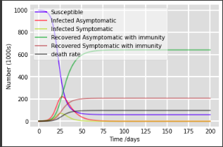

# Epidemic_Mathematical_Model

 It is a University project that aimed to predict the covid cases through the Epidemic Mathematical Model named $ S.I.R.S.A.D $ (Susceptible-Infected-Recovered Asymptomatic-Symptomatic and Dead). 

	We used the ‘odeint’ library to calculate all the ordinary differential equations, the ‘numpy’ library for mathematical manipulations and ‘matplotlib.pyplot’ to output the graphs. 

